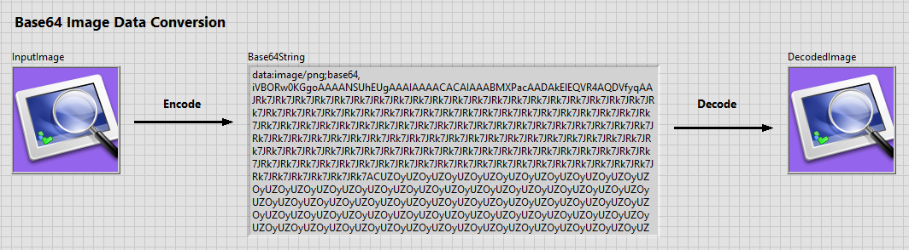
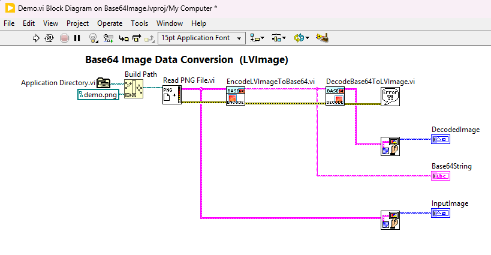
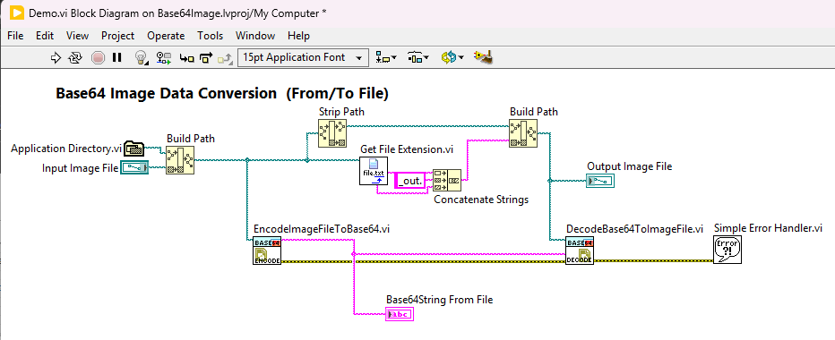

# LabVIEW Base64 Encoder für Bilddateien

Quellcode zum [Blog Artikel](https://kreiseder.org/2025/01/labview-base64-encoder-bilddateien) erschienen auf https://kreiseder.org

# Blog Artikel

Beim Einsatz vom NI LabVIEW wird bei messtechnischen Aufgaben sehr gerne auf das von Haus aus unterstützte TDMS-Datenformat gesetzt. Dieses Datenformat erlaubt die einfache Speicherung von Messverläufen mit dazugehörigen Metadaten. Oft hat man aber das Problem, dass bei verschiedenen Messaufgaben native RAW Dateien oder Bilddateien zusätzlich gespeichert werden müssen. Da das TDMS-Format, im Gegensatz zu Datenbanken, keinen Blob Datentyp kennt, müssen diese Dateien oft in einer Ordnerstruktur neben der Messdatei gespeichert werden und können nicht direkt in die TDMS-Datei eingebettet werden. Dadurch ergibt sich ein Mehraufwand bei der Weiterverarbeitung und bei der Archivierung dieser Datensätze.

Ein Blick auf andere Tools und Programmiersprachen schafft hier Abhilfe. Auf HTML-Seiten oder bei Markdown-Dateien können Bilder direkt im Code als String gespeichert werden und anschließend korrekt auf der Webseite dargestellt werden.

Dazu werden die Bilddateien Base64 codiert und mit einer Daten-URL versehen:

> [Base64](https://de.wikipedia.org/wiki/Base64) ist ein Verfahren zur Kodierung von 8-Bit-Binärdaten (z. B. ausführbare Programme, ZIP-Dateien oder Bilder) in eine Zeichenfolge, die nur aus lesbaren ASCII-Zeichen besteht.

> Ein [Data-URL](https://de.wikipedia.org/wiki/Data-URL) ist ein URI-Schema, das es ermöglicht, Daten in (HTML-)Quelltext so einzubetten, als wären es externe Ressourcen.

Dieses Verfahren kann in LabVIEW ebenfalls verwendet werden, um Bilddateien in String-Datentypen zu konvertieren und anschließend in der TDMS-Datei zu speichern. Hier können entweder einzelne Dateien als TDMS-Properties oder mehrere Dateien zusammengefasst als Array in einem TDMS-Channel gespeichert werden. 

Zum Speichern der Bilddateien würde zwar die reine Base64 Codierung ausreichen, die Data-URL ermöglicht aber die Selbstbeschreibung des Strings. Durch dieses standardisierte Verfahren ist die langfristige Lesbarkeit der Daten gewährleistet.

Ein vollständiges LabVIEW Projekt befindet sich auf [Github](https://github.com/matrixx567/LabView_Blog_Base64Image.git). Dieses zeigt die grundlegenden Funktionen, um zwischen Bilddateien und Base64-String bidirektional zu konvertieren.

Zusätzlich enthält das Projekt auch ein Python Skript, welches einen Base64-codierten String in eine Bilddatei ermöglicht. Dadurch kann gezeigt werden, dass ein in LabVIEW erzeugten Base64-String mit einer anderen Programmiersprache ausgelesen werden kann.

Zum Konvertieren der Daten wird der Base64 Encoder vom VIPM Paket [JDP Science Common Utilities](https://www.vipm.io/package/jdp_science_lib_common_utilities/) von James Powell verwendet.

## Adaptierungen

Im Projekt sind Funktionen enthalten, welche die direkte Konvertierung der Bilddateien in Base64-Strings durchführen. Durch geringe Adaptierungen können jegliche Arten von binären RAW-Dateien auf diese Weise in TDMS Dateien gespeichert werden. Hierfür müssen nur die entsprechenden  [MIME Typen](https://de.wikipedia.org/wiki/Internet_Media_Type) hinzugefügt werden, um das Decoding zu automatisieren.
